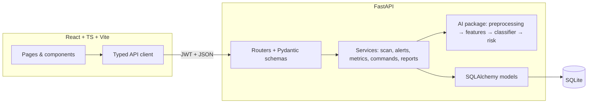
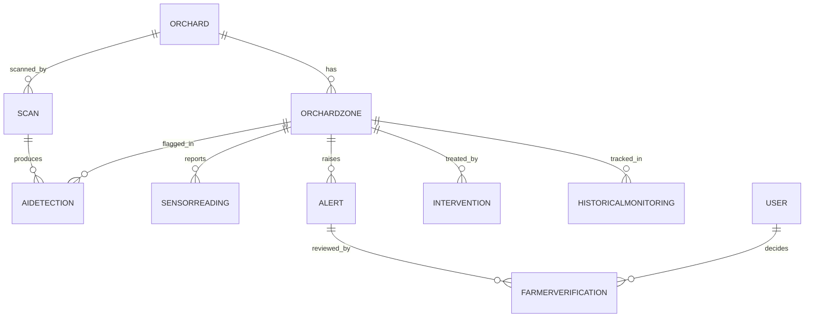

# CitrusGuardAI 🍊

**AI-powered farm monitoring and automation for large orange orchards in Vidarbha, Maharashtra, India.**

A real full-stack application: React frontend → typed API client → FastAPI → service layer → SQLAlchemy → SQLite → response → frontend. Every dashboard number comes from the database. Every button calls the real backend.

> **Credibility note (please read):** the AI classifier is trained on **synthetic** demo data, the drone is a **simulation**, the 91% confidence / 82/100 risk are **deterministic demo values** (not field accuracy), and the risk engine is a **prototype formula**, not a validated agricultural model. See [REAL vs SIMULATED](#real-vs-simulated) below.

## What it solves

Large orange orchards (50+ acres) in Vidarbha face delayed pest/disease detection, blanket pesticide sprays, and no central record of crop health. CitrusGuardAI gives farmers:

- **Crop monitoring** — dashboard KPIs + trend charts from real scan history
- **Pest/disease detection** — image analysis pipeline (OpenCV + scikit-learn) + per-zone AI detections
- **Orchard mapping** — Leaflet GIS map with 8 health-coloured zones
- **Actionable alerts** — risk-scored alerts with a transparent factor breakdown
- **Precision intervention** — plans target only the affected zone (never whole-orchard)
- **Farmer interface** — login, command console, reports
- **Human-in-the-loop control** — the AI can never act alone; interventions require a Verified alert

## Feature list

| Area | Features |
|---|---|
| Dashboard | 9 KPIs, health/risk trend, affected-area chart, monitoring history, RUN ORCHARD SCAN with 12-step animated progress |
| GIS Map | 8 zones coloured by health, click for zone panel (health, risk, AI confidence, sensors, recommendation) |
| Drone Mission | Clearly labelled SIMULATION; animated battery/coverage/images; real scan history |
| AI Analysis | Upload → preview → analyze → condition, confidence, severity, explanation, next step |
| Sensors | Per-zone current values, normal ranges, Normal/Warning/Critical status, trend chart |
| Alert Center | VERIFY / REJECT / REQUEST RESCAN — the human-in-the-loop step |
| Intervention | Target zone/area, reason, detection risk, precision-vs-full-orchard comparison. No pesticide dosage, ever. |
| History | Scans, detections, risk changes, alerts, interventions; search/filter/sort |
| Reports | One-click downloadable HTML report generated from the database |
| Command Console | `run scan`, `show zone B risk`, `list alerts`, `verify alert 1`, … (rule-based, NOT an LLM) |

## Architecture





## Tech stack and why

| Technology | Why |
|---|---|
| React + TypeScript + Vite | Component UI, type-safe API contracts, fast dev/build |
| Tailwind CSS | Consistent design system (deep green + citrus orange) without custom CSS bloat |
| Recharts | Declarative trend charts bound to real history data |
| Leaflet + OpenStreetMap | Free, offline-friendly orchard mapping (no API key) |
| FastAPI + Pydantic v2 | Validated schemas, auto Swagger docs at `/docs` |
| SQLAlchemy 2.x + SQLite | Relational integrity (FKs, CHECKs); zero-ops local demo DB |
| Alembic | Versioned migrations (`alembic upgrade head`) |
| scikit-learn + OpenCV + NumPy | Explainable classical-ML pipeline; replaceable via the `Predictor` protocol |
| JWT (python-jose) + bcrypt | Lightweight auth with hashed passwords; secrets only from `.env` |
| pytest + Vitest | Backend + frontend regression suites |

## Screenshots

Capture these pages into `docs/screenshots/` for the hackathon deck:

1. `dashboard.png` — Dashboard after RUN ORCHARD SCAN (KPIs + charts)
2. `map-zone-b.png` — GIS map with Zone B highlighted + detail panel
3. `drone.png` — Drone mission simulation mid-flight
4. `ai-analysis.png` — Uploaded image with analysis result
5. `alerts.png` — Alert Center with VERIFY buttons
6. `intervention.png` — Precision plan for Zone B only
7. `report.png` — Downloaded HTML report

## Quick start

**One command (Windows PowerShell, from the project root):**

```powershell
.\run.ps1
```

This checks the venv, `.env`, `node_modules`, and database (auto-creates it if missing), then opens backend + frontend in two windows. App: http://localhost:5173 (farmer / farmer123).

Manual method (two terminals) if you prefer:

```powershell
cd backend
python -m venv .venv
.\.venv\Scripts\Activate.ps1
pip install -r requirements.txt
copy .env.example .env   # from repo root if needed: copy ..\.env.example .env
alembic upgrade head
python -m app.database.seed
python -m app.ai.train_demo_model
uvicorn app.main:app --port 8000
```

```powershell
cd frontend
npm install
npm run dev
```

macOS/Linux: same, with `python3 -m venv`, `source .venv/bin/activate`, `cp ../.env.example .env`.

Full details: **[RUN_LOCAL.md](RUN_LOCAL.md)** (exact commands that were verified).

| What | URL |
|---|---|
| App | http://localhost:5173 |
| API docs (Swagger) | http://localhost:8000/docs |
| Health check | http://localhost:8000/health |

Demo logins: **farmer / farmer123** (farmer) · **operator / operator123** (operator)

## The demo (repeatable)

Login → Dashboard → **RUN ORCHARD SCAN** → scan completes → AI flags **Zone B** ("Possible Citrus Disease Stress", 91%, High, risk **82/100**) → map highlights Zone B → High-risk alert appears → open alert → **VERIFY** → precision intervention plan for Zone B only → history updated → report downloaded.

Reset anytime: `python -m app.database.seed --reset` (from `backend/`).

## API examples (curl)

```bash
# Health
curl http://localhost:8000/health

# Login (save the token)
curl -X POST http://localhost:8000/auth/login -H "Content-Type: application/json" \
  -d "{\"username\":\"farmer\",\"password\":\"farmer123\"}"

# Run a scan (replace TOKEN)
curl -X POST http://localhost:8000/scans -H "Content-Type: application/json" \
  -H "Authorization: Bearer TOKEN" -d "{\"orchard_id\":1}"

# Alerts, metrics, zones
curl http://localhost:8000/alerts -H "Authorization: Bearer TOKEN"
curl "http://localhost:8000/metrics?orchard_id=1" -H "Authorization: Bearer TOKEN"
curl http://localhost:8000/zones -H "Authorization: Bearer TOKEN"

# Verify an alert (human-in-the-loop)
curl -X POST http://localhost:8000/alerts/1/verify -H "Content-Type: application/json" \
  -H "Authorization: Bearer TOKEN" -d "{\"decision\":\"verify\",\"comment\":\"confirmed\"}"

# Command console (rule-based, not an LLM)
curl -X POST "http://localhost:8000/commands?orchard_id=1" -H "Content-Type: application/json" \
  -H "Authorization: Bearer TOKEN" -d "{\"command\":\"show zone B risk\"}"
```

## Project workflow

Phases 1–7 in [PROJECT_STATUS.md](PROJECT_STATUS.md): structure → database → AI → API → frontend → tests → docs. Each phase was run, verified, and committed before moving on. Tests: `pytest tests` (57 backend tests) + `npm test` in `frontend/` (20 tests).

## Troubleshooting

| Problem | Fix |
|---|---|
| `python` not found | Install Python 3.11+, tick "Add to PATH"; try `py` on Windows |
| `ModuleNotFoundError` | Activate the venv, rerun `pip install -r requirements.txt` |
| Port 8000/5173 in use | Stop the old process, or use `--port 8001` |
| Frontend cannot reach backend | Backend must run on :8000; CORS origin must include http://localhost:5173 |
| Empty dashboard | Reseed: `python -m app.database.seed --reset` |
| `URL.createObjectURL` in tests | Already stubbed in `src/setupTests.ts` (jsdom gap) |

## REAL vs SIMULATED

| REAL implementation | SIMULATED demo | ESTIMATED metrics | FUTURE field deployment |
|---|---|---|---|
| Full-stack CRUD, JWT auth, scan transaction, state machine, command parser, report gen | Drone flight/telemetry animation, IoT sensor feed values | Risk score formula, sensor-health %, coverage | Real drone control, field-trained model, validated agronomy |

## Docs

All design docs live in [`docs/`](docs/): problem, solution, architecture, AI/ML, GIS, IoT, drone workflow, precision ag, database, API, testing, costs, limitations, future scope, demo script, pitch, FAQ, and the [interview pack](docs/INTERVIEW_PACK.md).
