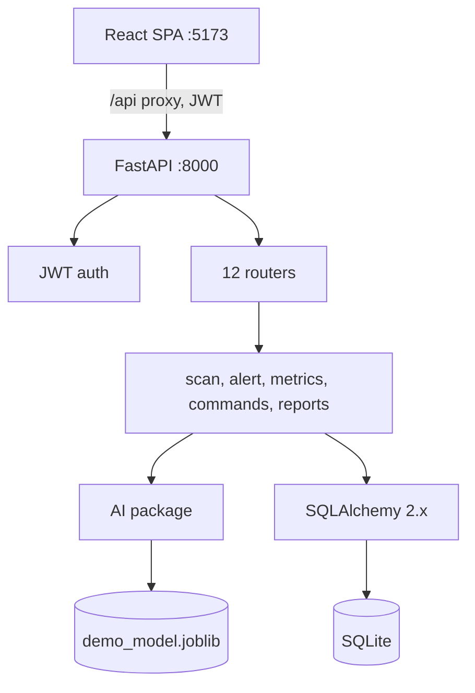

# System Architecture

## Runtime view

## Request lifecycle (example: RUN ORCHARD SCAN)

1. Dashboard button → `api.runScan(1)` (typed client, Bearer token).
2. Vite proxies `/api/scans` → FastAPI `POST /scans`.
3. `get_current_user` validates JWT; Pydantic validates `{orchard_id, scan_type}`.
4. `scan_service.run_scan` opens **one DB transaction**: create scan → per zone: sensor snapshot, AI detection (deterministic Zone B values in demo mode), zone health update, history row, Zone B alert.
5. Commit → response with scan + detections → frontend refreshes metrics, map, alerts.

## Module map

- `backend/app/main.py` — app factory, CORS from `.env`, router wiring.
- `backend/app/api/` — `deps.py` (auth), `routes/` (one module per resource).
- `backend/app/services/` — business logic + state machine + command parser.
- `backend/app/ai/` — preprocessing, features, predictor protocol, risk engine, service facade.
- `backend/app/models/` + `schemas/` — storage vs wire contracts (kept separate on purpose).
- `backend/app/core/` — settings, security, logging.
- `frontend/src/` — `api/` (one client), `components/` (reusable), `pages/` (one per route), `hooks/`, `types/`, `utils/`.

## Cross-cutting concerns

- **Auth:** JWT Bearer; login public, everything else requires a user.
- **Errors:** services raise `ValueError` with plain messages → routes map to 400/404; unhandled → 500 via FastAPI.
- **Logging:** stdlib logging to stdout; uvicorn access log shows every demo step.
- **Config:** pydantic-settings, `.env` never committed.
